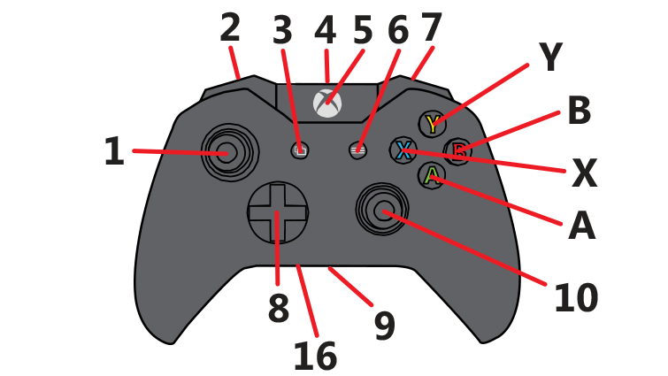

# Xbox Mouse
A simple, lightweight program that allows an Xbox One/360 controller to be used as a mouse.

Packages:
* SharpDX 4.2.0
* SharpDX.XInput 4.2.0

Controls:
* A is Left Click
* B is Right Click
* Y is Middle Click
* (1) Left Thumbstick is Mouse Movement
* (10) Right Thumbstick is Scrolling (Up/Down, Left/Right)

